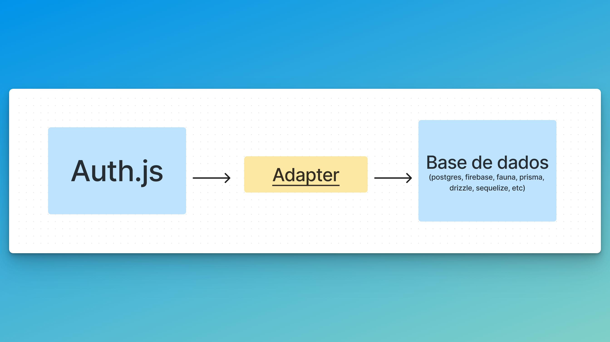

A primeira pergunta essencial que precisamos responder é: o que são adapters no *auth.js*?

### O que são adapters? 

Adapters (adaptadores) são um design pattern que permite que duas coisas incompatíveis conectem entre si. 

E aqui o exemplo mais recorrente sobre esse padrão é um fio com plug de tomada americana para ser ligado na parede com uma tomada brasileira. É claro que iremos precisar de um... 🥁🥁🥁

**Adaptador!**

... brincadeiras à parte, a analogia é perfeita para o que são adapters no *auth.js*

### O que são adapters no auth.js - ou, por que preciso deles?

Na verdade não precisamos *necessariamente* de adapters no *auth.js*. Mas *provavelmente* iremos precisar deles. Isso porque provavelmente precisaremos persistir os dados de autenticação em algum lugar. 

Quando eu digo que não precisamos necessariamente é porque é possível fazer autenticação (com GitHub, por exemplo) sem persistir nenhum dado em nenhuma base de dados. Mas isso é muito limitado para uma aplicação no mundo real. 

Então, em linhas simples, quando falamos em adapters, estamos falando em **conectar o Next** com uma **base de dados**. 

### Qual adapter usar? 

Depende de como estamos estruturando nossos dados. No nosso exemplo, como vamos utilizar o Prisma, vamos utilizar o [@auth/prisma-adapter](https://authjs.dev/reference/adapter/prisma)