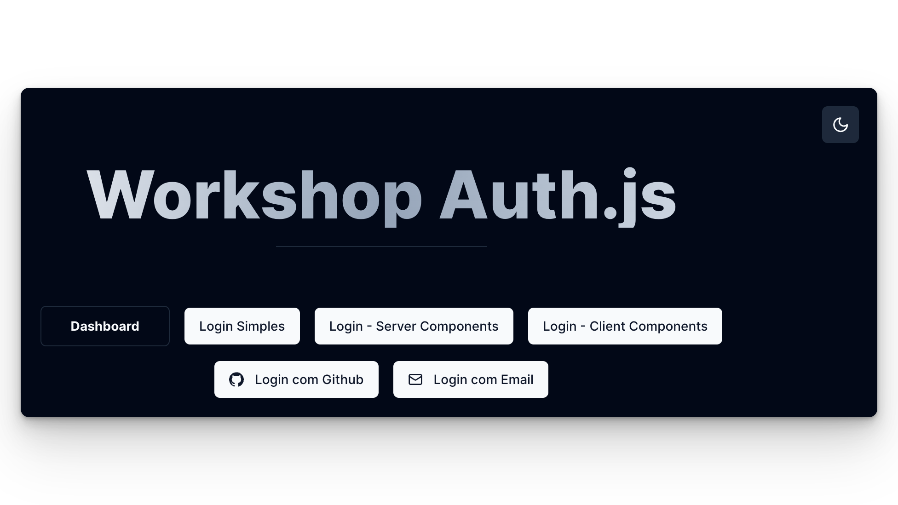
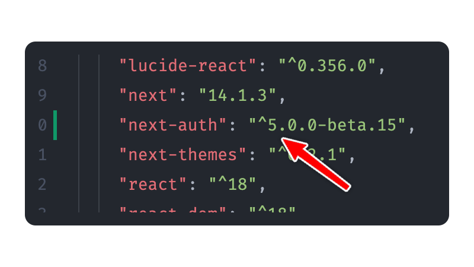

Temos então nossa aplicação, que é mais ou menos assim: 



Com exceção do Dashboard, nenhum desses botões (que na verdade são links) irá funcionar. Isso porque além de não termos ainda o NextAuth instalado, também não criamos nenhuma página para esses links. 

### Instalando o NextAuth

Obviamente, a primeira coisa que devemos fazer é instalar a biblioteca. Mas cuidado, é **absolutamente necessário que a gente instale a v5 e não a v4**. Isso porque se você simplesmente instalar o NextAuth sem especificar a versão, a versão instalada será a v4 (que é a estável atualmente). 

Rode o comando 

```bash
npm i next-auth@beta
```

E tenha certeza que a versão instalada é a versão 5. Para ter certeza, olhe o `package.json`



Maravilha! é só isso por enquanto. 