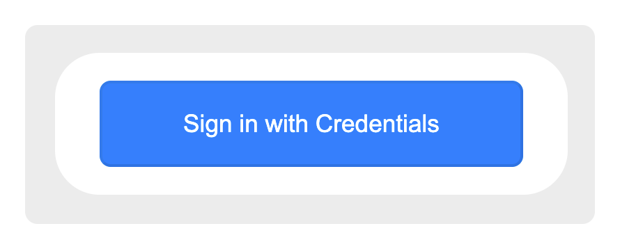
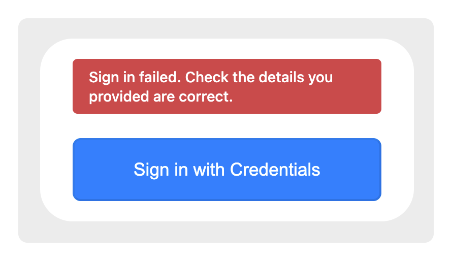
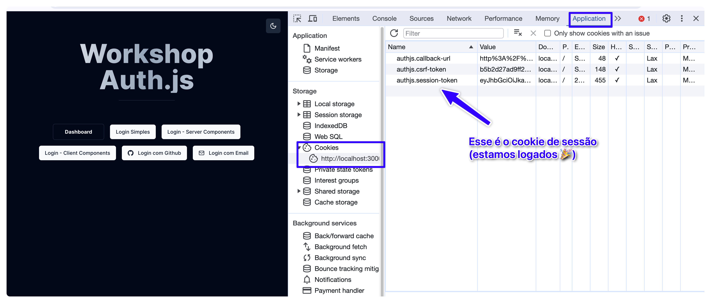
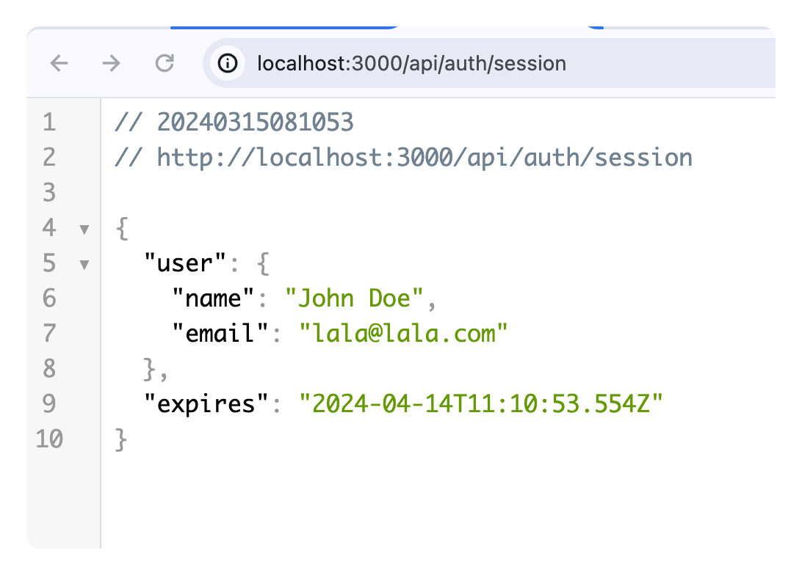

Vamos usar o provider de **credentials** para entendermos o fluxo do login, o que acha?

#### Criando o "Login Simples" com Credentials

Vamos usar o botão da home para nos direcionar para a página que já está pronta do NextAuth:

```tsx title="app/page.tsx" ins={1}
<Link href="/api/auth/signin" className={cn(buttonVariants())}>
  Login Simples
</Link>
```

Esse link deverá te levar para essa página:


Entretanto, ao clicarmos no botão, isso acontece:


Essa mensagem significa que o login não foi autorizado. Para fazermos a lógica de autorização funcionar (apenas no caso do provider *credentials*, viu?) precisamos adicionar uma função `authorize()` nas configurações do nosso provider. 

No nosso arquivo de configuração

```typescript title="auth.ts" ins={10-12}
import NextAuth from 'next-auth';
import Credentials from 'next-auth/providers/credentials';

export const {
  handlers: { GET, POST },
  auth,
} = NextAuth({
  providers: [
    Credentials({
      async authorize() {
        return { id: '1', name: 'Fulano de Tal', email: 'lala@lala.com'};
      },
    }),
  ],
});
```

A partir de agora, tudo vai funcionar. 

## O que está acontecendo por trás dos panos? 


#### 1. A função `authorize()`

Essa função é a peça fundamental para o login com  credenciais. 

Ela deverá: 

- retornar um `user` caso você "autorize" o login; 
- retornar `null` caso você não autorize o login;

No nosso caso retornamos um usuário fictício (Fulano de Tal) para dizer que, ao clicar o botão, você estará logado em nome dele! 

#### 2. Conseguimos então logar?

Sim, mas a partir de agora nesse Workshop quero que você se atente sempre aos cookies da nossa aplicação:




#### 3. Cookies de sessão 

Lembra que falamos sobre sessão e as estratégias de sessão. Estamos usando aqui a *estratégia de JWT*, em que toda a sessão (incluindo dados do usuário) fica no cookie. Você provavelmente não vai conseguir ler o cookie pois ele está criptografado.


#### 4. Checando a sessão ativa:

Para confirmarmos que realmente estamos logados, acesse a rota: 

`http://localhost:3000/api/auth/session`

Você deverá ver algo como isso (note que estou usando uma extensão para deixar o json formatado):



Já dá para ver o formato do objeto de sessão: 

- Um objeto `user`; 
- uma propriedade `expires` que nos diz exatamente quando a sessão irá expirar. 