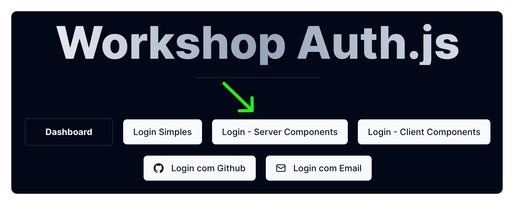
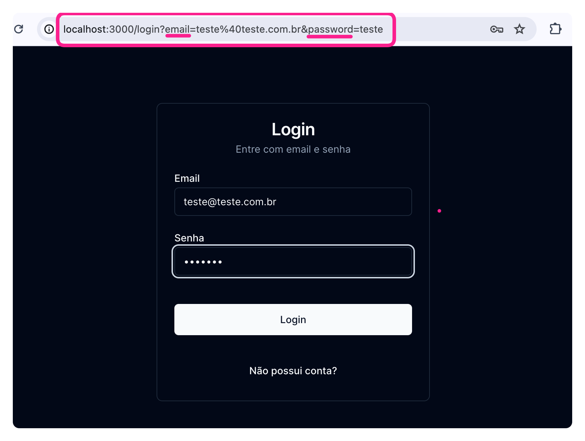

Já temos um template de página de login pronto para nós. Se quiser dar uma olhadinha basta acessar a rota `/login`. Vamos usar então essa rota no botão de "Login - Server Components"



```tsx title="app/page.tsx" ins={2}
// ...
<Link href="/login" className={cn(buttonVariants())}>
  Login - Server Components
</Link>
// ...
```

Maravilha. Agora que já estamos redirecionando, vamos ver o comportamento padrão dessa página:



O comportamento padrão de um formulário html é fazer um request GET para a mesma página passando os valores e nomes dos inputs como *query parameters*. 

**Se estivéssemos usando client components...**

Nós iríamos tomar controle da submissão do formulário com o evento `onSubmit`. E iríamos forçar a não acontecer o comportamento padrão (`e.preventDefault()`). E iríamos fazer todo o restante com javascript. 

**Mas estamos usando server components...**

Nesse caso então vamos fazer tudo um pouco diferente. Vale lembrar que o componente do formulário é o único componente *cliente*. A página de login é componente de servidor `use-server`.

1. Vamos criar uma *server action* de login que será chamada pelo nosso formulário;
2. Essa *server action* será responsável pelo nosso login; 
3. Vamos usar, no nosso componente de servidor,  os dados da sessão para fazer os redirecionamentos necessários. 
4. Vamos usar, no componente de servidor, os dados da sessão para imprimir o nome do usuário na tela. 
