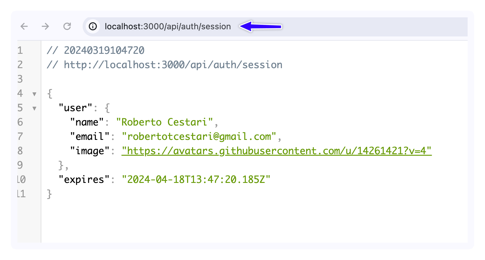

Se você notar, o único provider listado na nossa aplicação até agora é o provider `Credentials` (dá uma olhada no arquivo `auth.ts`). Agora vamos adicionar um novo provedor, o provedor do github.

Para isso, vamos importar o GithubProvider e adicioná-lo à lista de providers do nosso arquivo de configuraçòes:

```ts title="auth.ts" ins={5,13}
import NextAuth from 'next-auth';
import Credentials from 'next-auth/providers/credentials';
import { compareSync } from 'bcrypt-ts';
import db from './lib/db';
import GithubProvider from 'next-auth/providers/github';

export const {
  handlers: { GET, POST },
  signIn,
  auth,
} = NextAuth({
  providers: [
    GithubProvider({}),
    Credentials({
      credentials: {
        email: {
          label: 'Email',
          type: 'email',
          placeholder: 'email@exemplo.com.br',
        },
        password: { label: 'Senha', type: 'password' },
      },
      async authorize(credentials) {
        const email = credentials.email as string;
        const password = credentials.password as string;

        if (!email || !password) {
          return null;
        }

        const user = await db.user.findUnique({
          where: {
            email: email,
          },
        });

        if (!user) {
          return null;
        }

        const passwordMatch = compareSync(password, user.password ?? '');
        if (!passwordMatch) {
          return null;
        }

        return user;
      },
    }),
  ],
});
```

Pronto! Se você quiser ver em ação, clique no botão "Login Simples". Se tudo estiver certo, a opção de github deverá aparecer por lá!


Ou se preferir, pode também acessar a rota api de providers `/api/auth/providers`. Perceba que agora há 2 providers: github e credentials. 

Hora de testar! Tente clicar na autenticação com github. Depois, vá até a rota `/api/auth/session`. Algo como isso deverá aparecer:



Voilá! Já temos o login com Github! 

Agora falta apenas configurarmos a nossa página personalizada, que é o que faremos a seguir. 

