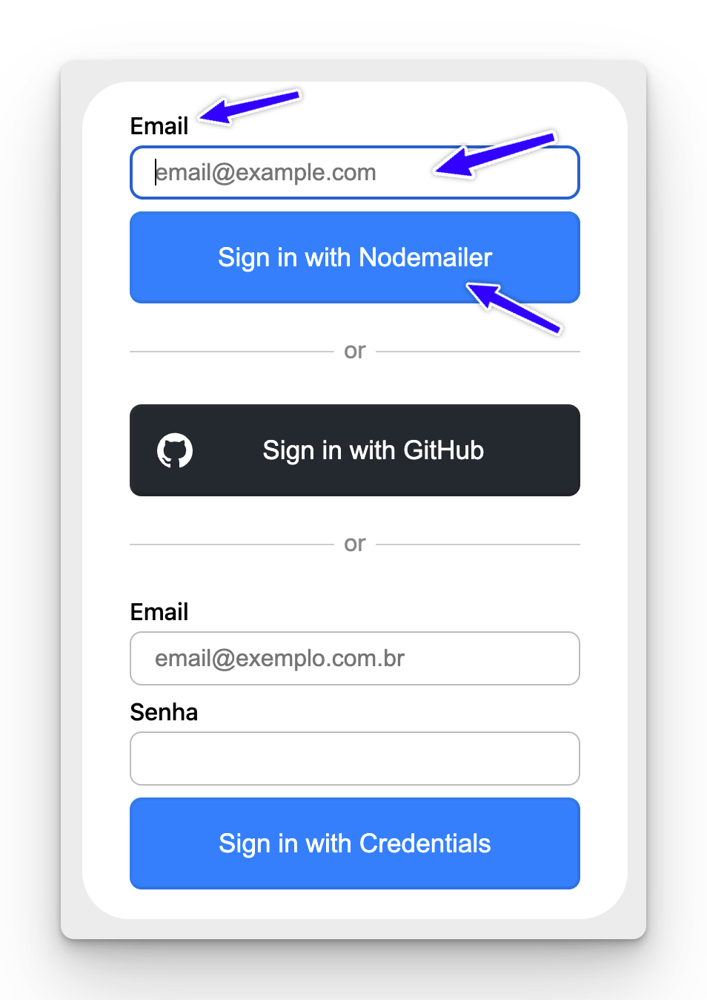

O primeiro passo será adicionar mais um _login provider_ à nossa lista. Dessa vez vamos utilizar o *nodemailer provider* do next-auth. Vamos seguir a documentação tanto [desta página](https://authjs.dev/guides/providers/email) como [desta](https://authjs.dev/reference/adapter/prisma) (prisma adapter)

### Instalando as Dependências

Para isso, precisamos instalar as dependências: 

```bash
npm i @auth/prisma-adapter nodemailer
```

Veja que instalamos tanto o **prisma adapter** como o **nodemailer**. O adapter serve para que o provider de email consiga escrever na nossa base de dados sem que precisemos criar nenhuma função. O nodemailer é o pacote responsável por enviar os emails de login por trás dos panos. 

### Configurando o Prisma Adapter

Para que tudo funcione automaticamente com o Prisma Adapter, precisamos adicionar algumas coisas no nosso `schema` do Prisma (lembra dele?). 

Abaixo o schema completo: 

```prisma title="prisma/schema.prisma"
// This is your Prisma schema file,
// learn more about it in the docs: https://pris.ly/d/prisma-schema

generator client {
  provider = "prisma-client-js"
}

datasource db {
  provider = "sqlite"
  url      = env("DATABASE_URL")
}

model User {
  id            String    @id @default(cuid())
  name          String?
  email         String    @unique
  emailVerified DateTime?
  password      String?
}

model VerificationToken {
  identifier String
  token      String   @unique
  expires    DateTime

  @@unique([identifier, token])
}
```

### Preenchendo o `.env` com dados do provedor de email

Vamos adicionar 5 novas chaves no nosso `.env`:

```bash title=".env"
EMAIL_SERVER_HOST="smtp.mailgun.org"
EMAIL_SERVER_PORT=587
EMAIL_SERVER_USER="roberto@mg.codante.io"
EMAIL_SERVER_PASSWORD=xxxxxx
EMAIL_FROM=roberto@codante.io
```

É claro que você deverá preencher com os dados **do seu host**.

Feito isso, vamos adicionar nosso EmailProvider ao nosso arquivo `auth.ts`.

### Adicionando um novo provider ao `auth.ts`. 

```ts title="auth.ts" ins={6-7,15-18,20-30}
import NextAuth from 'next-auth';
import Credentials from 'next-auth/providers/credentials';
import { compareSync } from 'bcrypt-ts';
import db from './lib/db';
import GithubProvider from 'next-auth/providers/github';
import EmailProvider from 'next-auth/providers/nodemailer';
import { PrismaAdapter } from "@auth/prisma-adapter"


export const {
  handlers: { GET, POST },
  signIn,
  auth,
} = NextAuth({
  adapter: PrismaAdapter(db),
  session: {
    strategy: 'jwt',
  },
  providers: [
    EmailProvider({
      server: {
        host: process.env.EMAIL_SERVER_HOST,
        port: process.env.EMAIL_SERVER_PORT,
        auth: {
          user: process.env.EMAIL_SERVER_USER,
          pass: process.env.EMAIL_SERVER_PASSWORD,
        },
      },
      from: process.env.EMAIL_FROM,
    }),
    GithubProvider({}),

//...
```

Note algumas coisas: 

1. Precisamos forçar a estratégia de sessão para ser jwt (senão teremos um erro)
2. Adicionamos o `PrismaAdapter` como adapter 
3. Adicionamos o `EmailProvider` com os dados todos vindos do `.env`. 


### Testando

Para termos certeza de que tudo está funcionando, vamos entrar na rota `/api/auth/signin` e a tela deverá ser mais ou menos essa:



Coloque seu email e teste! Tudo deverá estar funcionando! 

Maravilha, agora o último passo é configurar o nosso form customizado para o login por email. 