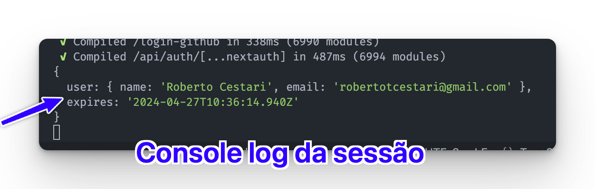
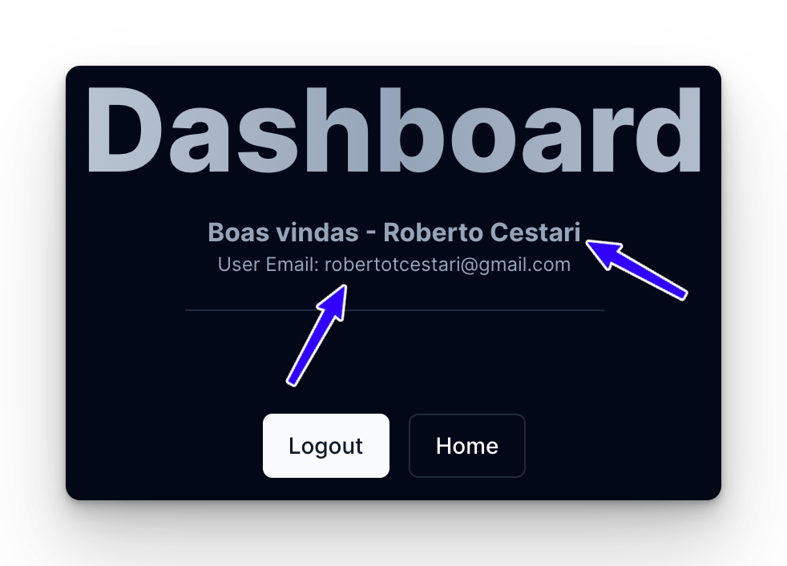

Maravilha, a partir de agora já temos uma boa noção de como funciona o fluxo de autenticação do NextAuth.js.

Agora, vamos começar a "usar" alguns recursos da autenticação para criar páginas mais significativas para nossos usuários. A primeira coisa que faz sentido implementarmos (e inclusive vai trazer mais nitidez sobre o estado de login do usuário) é, no dashboard, mostrar o nome e o email do usuário.

Para isso, vamos pegar os dados da sessão.

Em nossa página de dashboard, vamos pegar a sessão simplesmente esperando a função `auth()`.

Vamos ver o que essa função retorna fazendo um `console.log()`.

```tsx title="app/dashboard/page.tsx" ins={1,7-8}
import { auth } from '@/auth';
import { Button, buttonVariants } from '@/components/ui/button';
import { cn } from '@/lib/utils';
import Link from 'next/link';

export default async function Dashboard() {
  const session = await auth();
  console.log(session);

  return (
    <main className="container p-20 mx-auto text-center">
      <div>
        <h1 className="font-extrabold text-slate-600 dark:text-transparent text-7xl dark:bg-gradient-to-r dark:from-slate-50 dark:via-slate-400 dark:to-slate-200 bg-clip-text">
          Dashboard
        </h1>
        <h3 className="mt-4 font-bold text-muted-foreground">Boas vindas!</h3>
        <hr className="w-1/4 mx-auto mt-5 mb-16" />

        <section className="flex flex-wrap items-center justify-center gap-3">
          <form>
            <Button>Logout</Button>
          </form>
          <Link href="/" className={cn(buttonVariants({ variant: 'outline' }))}>
            Home
          </Link>
        </section>
      </div>
    </main>
  );
}
```

Veja que, quando estamos deslogando, essa função retorna `null`. E quando estamos logados ela retorna nossa sessão (que provavelmente possui uma chave `expires` e um objeto `user`):



Vamos usar esses dados para popular nosso dashboard!

#### Usando dados do User no Dashboard

Vamos alterar nossa página de dashboard mais uma vez:

```tsx title="app/dashboard/page.tsx" ins={1,4,8-12, 21, 23-25}
import { auth } from '@/auth';
import { Button, buttonVariants } from '@/components/ui/button';
import { cn } from '@/lib/utils';
import { User } from 'next-auth';
import Link from 'next/link';

export default async function Dashboard() {
  let user = undefined;
  const session = await auth();
  if (session) {
    user = session.user;
  }

  return (
    <main className="container p-20 mx-auto text-center">
      <div>
        <h1 className="font-extrabold text-slate-600 dark:text-transparent text-7xl dark:bg-gradient-to-r dark:from-slate-50 dark:via-slate-400 dark:to-slate-200 bg-clip-text">
          Dashboard
        </h1>
        <h3 className="mt-4 font-bold text-muted-foreground">
          Boas vindas - {user?.name ?? ''}
        </h3>
        <p className="text-xs text-muted-foreground">
          User Email: {user?.email ?? ''}
        </p>
        <hr className="w-1/4 mx-auto mt-5 mb-16" />

        <section className="flex flex-wrap items-center justify-center gap-3">
          <form>
            <Button>Logout</Button>
          </form>
          <Link href="/" className={cn(buttonVariants({ variant: 'outline' }))}>
            Home
          </Link>
        </section>
      </div>
    </main>
  );
}
```

Agora, quando você estiver logado esses dados deverão aparecer: 

