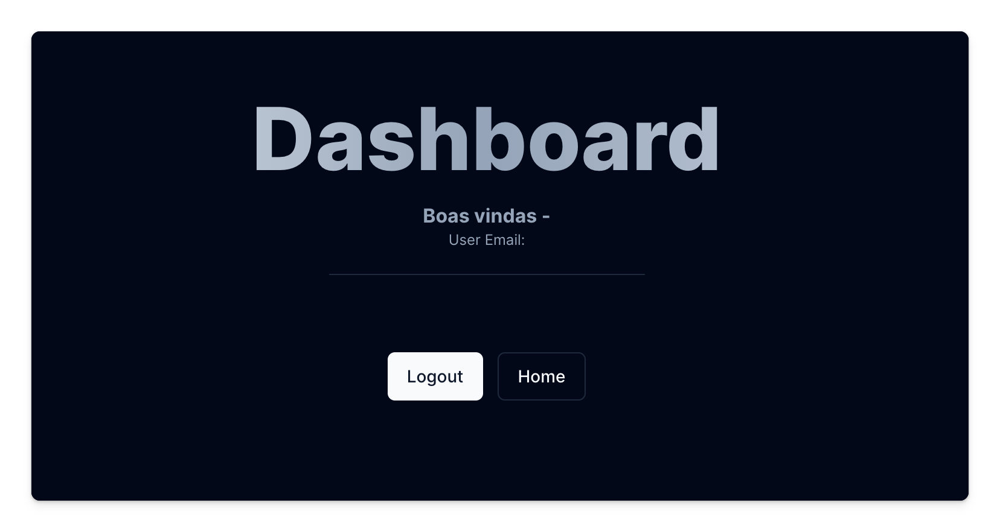

Agora precisamos implementar o _logout_ e fazer o nosso botão de Logout funcionar.

Pra isso, vamos voltar no nosso arquivo `auth.ts` e veja que a função `NextAuth` retorna também uma função `signOut`. Vamos exportá-la então:

```ts title="auth.ts" ins={12}
import NextAuth from 'next-auth';
import Credentials from 'next-auth/providers/credentials';
import { compareSync } from 'bcrypt-ts';
import db from './lib/db';
import GithubProvider from 'next-auth/providers/github';
import EmailProvider from 'next-auth/providers/nodemailer';
import { PrismaAdapter } from '@auth/prisma-adapter';

export const {
  handlers: { GET, POST },
  signIn,
  signOut,
  auth,
} = NextAuth({
  adapter: PrismaAdapter(db),
  session: {
    strategy: 'jwt',
  },
  providers: [
//...

```

Agora já podemos utilizar essa função na action que iremos fazer.

### Criando a action de logout

Vamos criar a action dentro da pasta `(auth)`.

```tsx title="app/(auth)/_actions/logout.ts"
'use server';

import { signOut } from '@/auth';

export default async function logout() {
  try {
    await signOut();
  } catch (e) {
    throw e;
  }
}
```

A função logout não possui nenhum parâmetro. Basta invocá-la e o logout será feito 🙂

### Fazendo a ligação entre a action e o botão

Vamos agora chamar a action em nosso botão de logout:

```tsx title="app/dashboard/page.tsx" ins={6,30-32}
import { auth } from '@/auth';
import { Button, buttonVariants } from '@/components/ui/button';
import { cn } from '@/lib/utils';
import { User } from 'next-auth';
import Link from 'next/link';
import logout from '../(auth)/_actions/logout';

export default async function Dashboard() {
  let user = undefined;
  const session = await auth();
  if (session) {
    user = session.user;
  }

  return (
    <main className="container p-20 mx-auto text-center">
      <div>
        <h1 className="font-extrabold text-slate-600 dark:text-transparent text-7xl dark:bg-gradient-to-r dark:from-slate-50 dark:via-slate-400 dark:to-slate-200 bg-clip-text">
          Dashboard
        </h1>
        <h3 className="mt-4 font-bold text-muted-foreground">
          Boas vindas - {user?.name ?? ''}
        </h3>
        <p className="text-xs text-muted-foreground">
          User Email: {user?.email ?? ''}
        </p>
        <hr className="w-1/4 mx-auto mt-5 mb-16" />

        <section className="flex flex-wrap items-center justify-center gap-3">
          <form action={logout}>
            <Button>Logout</Button>
          </form>
          <Link href="/" className={cn(buttonVariants({ variant: 'outline' }))}>
            Home
          </Link>
        </section>
      </div>
    </main>
  );
}
```

Se tudo der certo, ao fazer o logout, o dashboard deverá estar mais ou menos parecido com isso: 



Veja que não temos mais as infos do usuário. 

O próximo passo é proteger essa rota, ou seja, não permitir que ela seja acessada com uma sessão deslogada. 