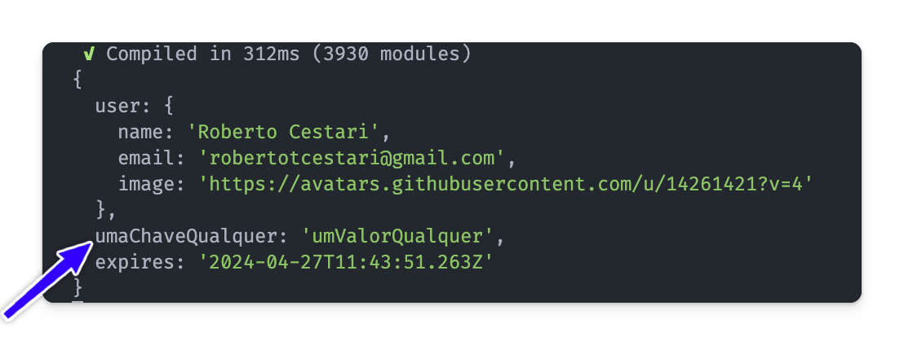
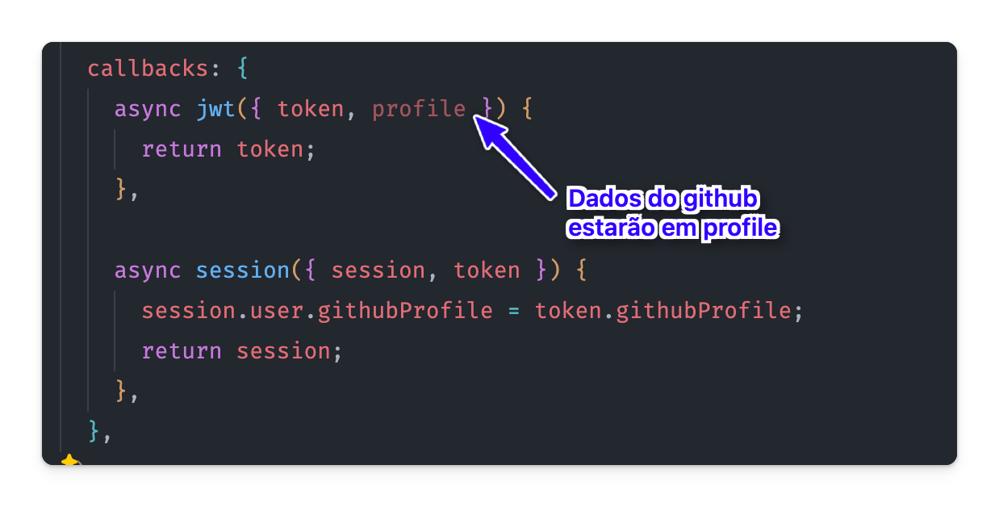
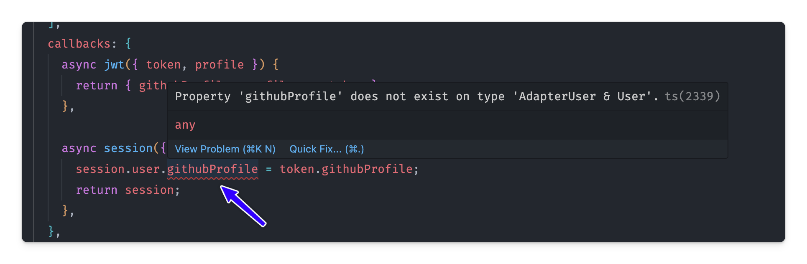

Imagine que eu queira, na minha sessão, mostrar os dados do usuário do github - o username do github, por exemplo. Veja que a nossa sessão traz, por padrão, apenas nome, email e imagem.

Para adicionarmos mais dados à nossa sessão precisamos usar um recurso do NextAuth chamado **callbacks**.

Já falamos de callbacks antes, e nesse caso, vamos começar usando a callback `session`.

```ts title="auth.ts" ins={22-26}
import NextAuth from 'next-auth';
import Credentials from 'next-auth/providers/credentials';
import { compareSync } from 'bcrypt-ts';
import db from './lib/db';
import GithubProvider from 'next-auth/providers/github';
import EmailProvider from 'next-auth/providers/nodemailer';
import { PrismaAdapter } from '@auth/prisma-adapter';

export const {
  handlers: { GET, POST },
  signIn,
  signOut,
  auth,
} = NextAuth({
  adapter: PrismaAdapter(db),
  session: {
    strategy: 'jwt',
  },
  providers: [
    // ...
  ],
  callbacks: {
    async session({ session, user, token }) {
      return { umaChaveQualquer: 'umValorQualquer', ...session };
    },
  },
});
```

Veja que a callback `session` traz 3 argumentos:

- session
- user
- token

E você precisa retornar uma session. Nesse caso, antes de retornar a session, adicionei uma chave qualquer.

A partir desse momento, esses dados já estão incorporados na sessão. Veja o console.log:



O que precisamos agora, é o seguinte fluxo:

1. Pegarmos dados adicionais do github
2. Adicionar esses dados ao meu token
3. Do meu token, adicionar os dados à sessão.

### Pegando dados adicionais do github

Para trazermos os dados adicionais do GitHub para a sessão, vamos criar uma outra callback, a `jwt`. Isso porque os dados de perfil do github chegarão por lá:



Precisamos adicionar esses dados ao token, uma vez que conseguimos pegar o token no callback session:

```ts title="auth.ts" ins={3}
callbacks: {
    async jwt({ token, profile }) {
      return { githubProfile: profile, ...token };
    },
```

Se agora fizermos um `console.log()` na nossa callback `session`, veremos que o token tem a chave `githubProfile`.
Basta então pegarmos esses dados e adicionarmos ao `user`:

```ts title="auth.ts" ins={7}
  callbacks: {
    async jwt({ token, profile }) {
      return { githubProfile: profile, ...token };
    },

    async session({ session, token }) {
      session.user.githubProfile = token.githubProfile;
      return session;
    },
  },
```

Pronto! Quer dizer, **mais ou menos**, ainda temos um erro de tipo:



Para resolvermos esse erro de tipo, basta adicionar no topo do nosso arquivo o seguinte código:

```ts title="auth.ts" ins={9-15}
import NextAuth, { User } from 'next-auth';
import Credentials from 'next-auth/providers/credentials';
import { compareSync } from 'bcrypt-ts';
import db from './lib/db';
import GithubProvider from 'next-auth/providers/github';
import EmailProvider from 'next-auth/providers/nodemailer';
import { PrismaAdapter } from '@auth/prisma-adapter';

declare module 'next-auth' {
  interface Session {
    user: User & {
      githubProfile: any;
    };
  }
}

export const {
  handlers: { GET, POST },
  signIn,
  signOut,
  auth,
} = NextAuth({
  adapter: PrismaAdapter(db),

// ...
```

O que fizemos aqui é que aumentamos o módulo next-auth de forma a aceitar, na session, um user que tenha também um githubProfile. E o tipo do githubProfile podemos deixar, por ora, como `any`, mas pode ser o tipo exato do objeto retorno do GitHub.

### Usando os dados no Dashboard

Agora podemos usar todos os dados que quisermos. Nesse exemplo, vou usar o username e a bio do GitHub:

```tsx title="app/dashboard/page.tsx" ins={14-19}
// ...
return (
    <main className="container p-20 mx-auto text-center">
      <div>
        <h1 className="font-extrabold text-slate-600 dark:text-transparent text-7xl dark:bg-gradient-to-r dark:from-slate-50 dark:via-slate-400 dark:to-slate-200 bg-clip-text">
          Dashboard
        </h1>
        <h3 className="mt-4 font-bold text-muted-foreground">
          Boas vindas - {user?.name ?? ''}
        </h3>
        <p className="text-xs text-muted-foreground">
          User Email: {user?.email ?? '-'}
        </p>
        <p className="text-xs text-muted-foreground">
          Username: {user?.githubProfile.login ?? '-'}
        </p>
        <p className="text-xs text-muted-foreground">
          Bio: {user?.githubProfile.bio ?? '-'}
        </p>
        <hr className="w-1/4 mx-auto mt-5 mb-16" />
// ...
```

Pronto! Agora as informações deverão aparecer no dashboard!
